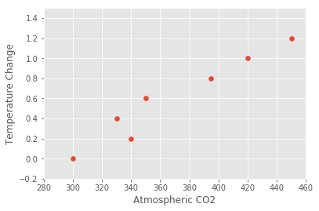
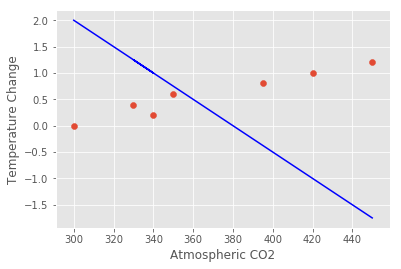
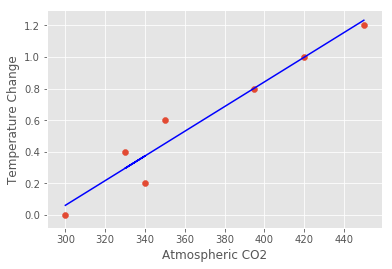
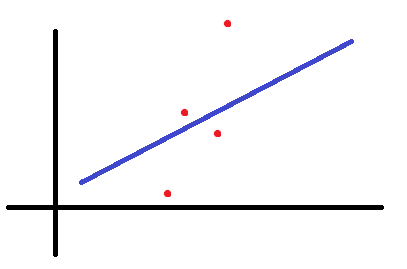

Imagine you are a scientist working for a government environmental agency. Your boss is very worried about this "global warming" that people keep talking about, and has tasked you with finding out the truth. You have the following data:

|Global Average Temperature Change|Atmospheric $CO_2$|
|:--:|:--:|
|$0.0^\circ C$|$300ppm$|
|$0.2^\circ C$|$320ppm$|
|$0.4^\circ C$|$340ppm$|
|$0.6^\circ C$|$360ppm$|
|$0.8^\circ C$|$380ppm$|
|$1.0^\circ C$|$400ppm$|
|$1.2^\circ C$|$420ppm$|

One way of trying to finding the relationship between two variables is to build a model. Models are used in nearly every scientific field, in an attempt to make sense of the world around us. Models consist of variables, and the relationships between these variables. We measure these relationships, or trends by using mathematical functions to define them. Trends can be positive (as $x$ increases, so does $y$) or negative (as $x$ increases, $y$ decreases), as some examples.

$x$ and $y$ could be anything, but in our case they are the global average temperature change, and the atmospheric $CO_2$. Now let's try and see how we can find a line to define the relationship between these two variables.

Recall that the formula for a line is:
$$y = mx + b$$

where $y$ represents our **dependent variable**, the variable which will be affected by the others in the model. $x$ represents our **independent variable**, $m$ represents the **slope** of the line, which gives us a measurement of how much our independent variable changes as our dependent variable changes. Finally, $b$ is a constant which determines the **intercept** of the line, and in our model this will give us a rough estimate of our dependent variable if our independent variable were to have a value of 0.

If we plot our data points, we get:

We want to predict what the effect of more $CO_2$ in the atmosphere would be, and a good place to start might be to draw a line through the existing points we have so let's try a few lines.

 

 

 

Clearly, not every line is equal in this sense. Some lines are better than others.

Although we can see that it would be impossible to place a straight line that touches all of the points, we can try to get as close as possible to all of the points. We can call this *close enough* line the **line of best fit**.

If we plot this line on top of our previous scatter plot, it looks like the graph below.

 If we extended this line further, we could make a reasonably educated guess at what the temperature change would be at higher $CO_2$ levels. But how do we know that we've found the *true* line of best fit and not a line of almost-best fit?

 To answer this question, let's first take a look at how our individual points are spread out around the line.

 While these points seem to trend upwards in general, the fact that the points do not lie in a straight line tells us that it is not a **deterministic** relationship. That is to say, a $20ppm$ increase in atmospheric $CO_2$ does not always cause the same change in temperature, so there is something about the data generating process which causes the observations to vary from a straight line.

 Now, instead of writing out the equation for a line, let's try to write an equation for each point.

 $$
 z_i = y + d_i
 $$

 $z_i$ here is each of our data points, $y$ is the line we just drew, and $d_i$ is the vertical distance between our line of best fit and the actual data point. We'll refer to these $d_i$'s as **error terms**

If we could draw a line through all of the points, the $d_i$ term for each of them would be 0. Since we can't do this with a straight line, our line of best fit should be the line that minimizes the total of these $d_i$ values.

Our goal then, is to estimate the values of $m$ and $b$ so that we can get a line that minimizes the magnitude of the sum of $d_i$.

To do so, let's think about our error terms as a function of our data points and the line. The error term is simply the value of the independent variable ($z_i$, or temperature change), minus the value of the line at that $x_i$ value corresponding to that z_i

Mathematically, this looks like:

$$
d_i = z_i - y
$$

From here we can see that points above the line will have $d_i > 0$, while points below the line will have $d_i < 0$

Now we'll just substitute in our equation for a line for y, and we'll get:

$$
d_i = z_i - mx_i - b
$$

Let's look a quick example, something like:

We'll suppose that the points close to the line have $d_1=2$ and $d_2 = -2$, while the points further away have $d_3 = 6$ and $d_4 = -6$

The sum of these error terms is $d_1 + d_2 + d_3 + d_4 = 2-2+6-6 = 0$

This tells us we have an almost perfect line of best fit, even though some points are very far from the line, and others are quite close. To fix this issue, let's square our error terms. This will penalize large errors more than small errors, and has the additional benefit of always giving us a positive result, regardless of if there are more points above or below the line, and stops our error terms from cancelling each other out.

Now that we have $d_i$ as a function of $m$ and $b$, and we've figured out how to deal with negative and differently sized error values, we have a problem that can be solved by a touch of light calculus. We just need to minimize the squared error terms by selecting an appropriate $m$ and $b$. This can be written mathematically as:

$$
\min_{m,b} \sum^n_{i=1}d_i^2 = \sum^n_{i=1}(z_i - mx_i - b)^2
$$

And there we have it; by solving this equation, we can ensure that our line of best fit is truly the one that comes closest to all of the points in our data set. This method of estimation, or **estimator** is called **Ordinary Least Squares**, commonly just called **OLS** for short.
